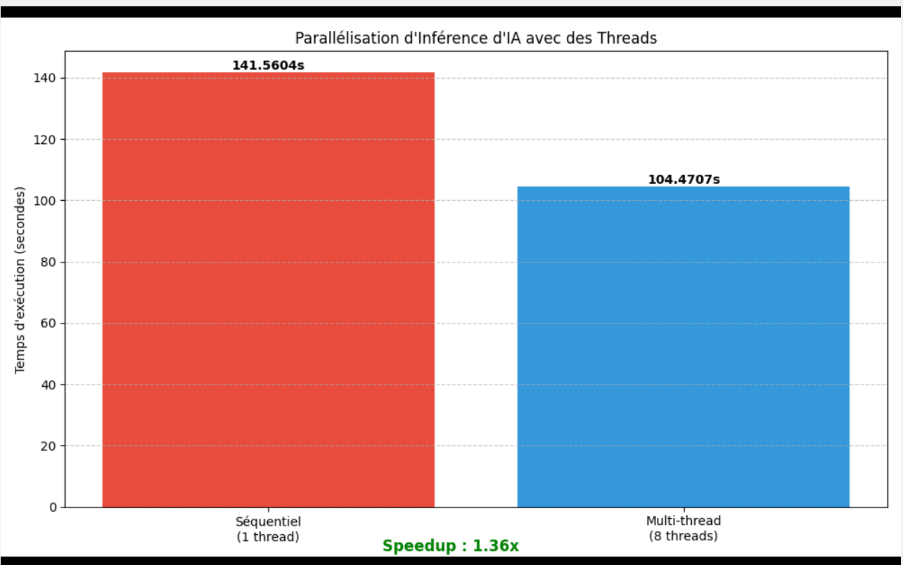

# Rapport de Projet : Parallélisation d'Inférence IA avec PyTorch

## 1. Introduction
Ce document présente les étapes complètes et les résultats d'une expérimentation visant à accélérer les tâches d'inférence d'IA (Deep Learning) sur CPU. Nous documentons ici l'intégralité du processus, de la configuration de l'environnement Linux à l'analyse des performances finales.

---

## 2. Préparation de l'Environnement (Journal de Bord)

Cette section documente les étapes préliminaires nécessaires pour reproduire l'expérience sur une machine virtuelle Ubuntu.

### Étape 1 : Création du Script
Nous avons commencé par créer le fichier source `main.py` directement dans le terminal.


### Étape 2 : Mise à jour du Système
Avant toute installation, nous avons mis à jour les dépôts du système pour garantir la compatibilité.


### Étape 3 : Installation des Dépendances Système
Installation de `pip` (gestionnaire de paquets Python) nécessaire pour installer PyTorch.


### Étape 4 : Installation des Bibliothèques IA
Installation des bibliothèques scientifiques : `torch` (PyTorch), `torchvision`, `numpy` et `matplotlib`.


---

## 3. Configuration Matérielle (VirtualBox)

Pour que le parallélisme soit effectif, il est crucial d'allouer plusieurs cœurs virtuels à la machine.

### Configuration Initiale (Avant optimisation)
Vue des paramètres système avant l'allocation optimale.


### Configuration Optimale (8 vCPUs)
Nous avons alloué **8 processeurs** à la VM pour permettre l'exécution simultanée des threads.


---

## 4. Implémentation Technique

Le script compare deux méthodes d'exécution :

### A. Approche Séquentielle (Code)
```python
def approche_sequentielle(modele, data_list):
    """ Exécution classique : 1 thread """
    print("\n[PROCESS] Exécution SÉQUENTIELLE (1 thread)...")
    resultats = []
    for data in data_list:
        res = tache_inference(modele, data)
        resultats.append(res)
    return resultats
```

### B. Approche Multi-thread (Code Optimisé)
```python
def approche_multithread(modele, data_list, num_threads):
    """ Parallélisme : 8 threads """
    # Découpage des données en batches
    batch_size = len(data_list) // num_threads
    # ...
    # Exécution parallèle relâchant le GIL
    with concurrent.futures.ThreadPoolExecutor(max_workers=num_threads) as executor:
        futures = [executor.submit(traiter_batch, batch) for batch in batches]
```

---

## 5. Exécution et Résultats

### Sortie Terminal
Le script a été exécuté avec succès, confirmant le chargement du modèle ResNet18 et l'exécution des deux phases de test.


### Analyse des Performances
Les résultats finaux pour 100 inférences sont les suivants :

| Méthode | Temps d'exécution | Observations |
| :--- | :--- | :--- |
| **Séquentiel** | **141.56 s** | Traitement linéaire lent |
| **Multi-thread (8 threads)** | **104.47 s** | Traitement parallèle rapide |
| **Gain (Speedup)** | **1.36x** | Accélération confirmée |

### Graphique Final
Visualisation de la différence de temps d'exécution.



## 6. Conclusion
L'expérience valide que l'allocation de ressources matérielles adéquates (8 vCPUs) couplée à une programmation Multi-thread efficace permet d'améliorer significativement les performances d'inférence d'IA, même dans un environnement virtualisé.
